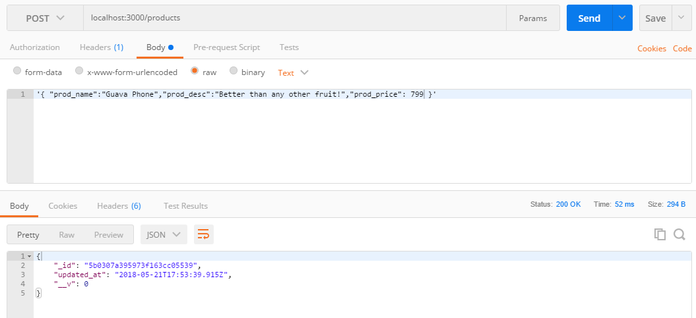
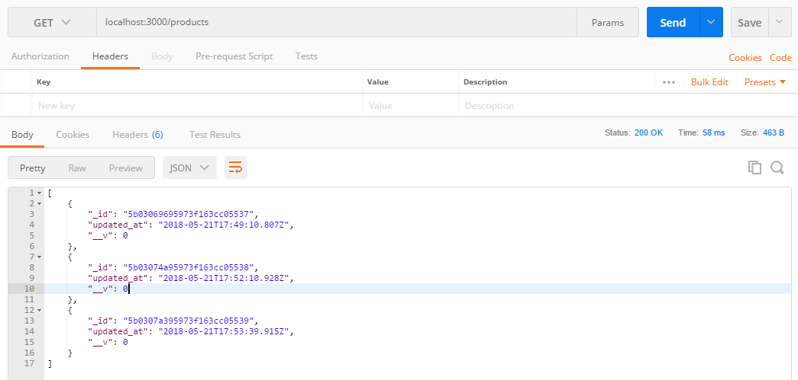

# NodeJS-CURD-API

> A simple CURD API made with Express, Node and MongoDB.


## Screenshots:


> Creating a new product by sending a post request.



> Getting all the product information by sending a get request.

## Requirements & Set-up

MongoDB
NodeJS
ExpressJS

After putting all files in a folder go to console:
```sh
npm install
mongod
npm start
```
